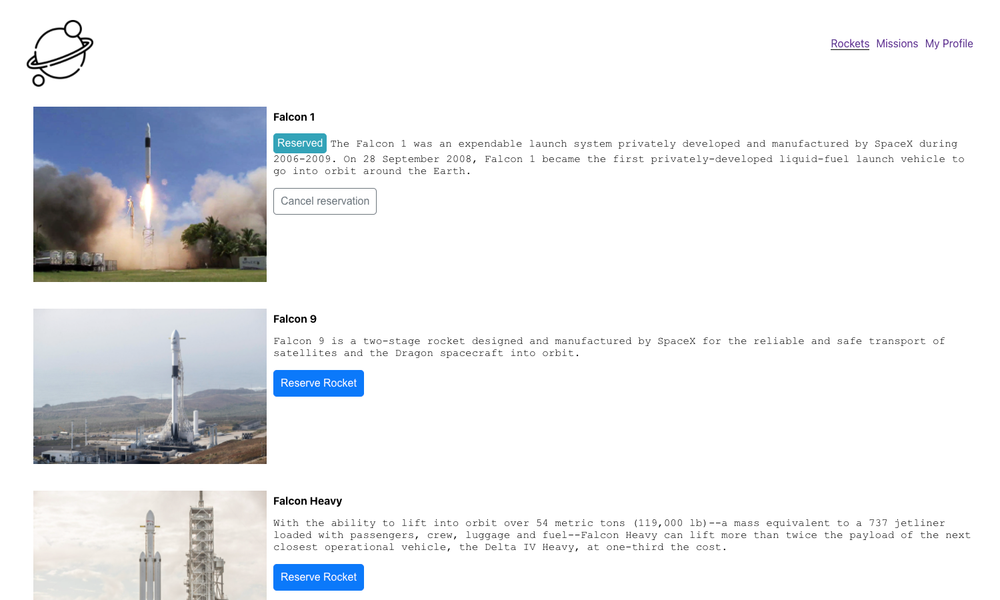

# Space Travelers' Hub

> The Space Travelers' Hub is a web application for a company that provides commercial and scientific space travel services. It works directly with real live data from the SpaceX API. The application will allow users to book rockets and join selected space missions.

## Screenshots

  

  

  

## Built With

- React
- Redux
- CSS
- Jest

## Live Demo

[Live Demo Link](https://dazzling-feynman-4f0073.netlify.app)

## Getting Started

### To get a local copy run the following steps:

- Open your terminal or command line and run `git clone https://github.com/themonster2015/SpaceTravellerHub.git`
- Open the folder with your code editor (VS Code for example)
- Run `npm install`
- Run `npm run build`
- Run `npm start` to launch the server and view it in the browser.

## Author

👤 **Vo Thi Quynh Yen**

- GitHub: [@themonster2015](https://github.com/themonster2015)

👤 **Daniel M. Matongo**

- GitHub: [@mmatongo](https://github.com/mmatongo)
- LinkedIn: [Daniel M. Matongo](https://linkedin.com/in/mmatongo)

## 🤝 Contributing

Contributions, issues, and feature requests are welcome!

Feel free to check the [issues page](https://github.com/themonster2015/SpaceTravellerHub/issues).

## Show your support

Give a ⭐️ if you like this project!

This project is [MIT](./MIT.md) licensed.